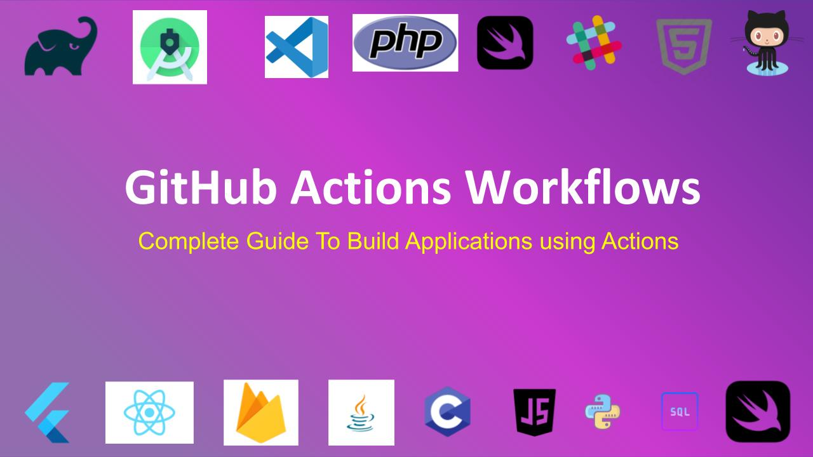

# Awesome GitHub Actions for Open Source Development + DevOps :boom:       &nbsp;     

You all can add your specific github actions workflows for a particular values. But pls create a Folder with your name, if possible you can also add your README.md file in it.

I will try to create a table in the README file of this project, so that everyone can have all the Actions/Workflows listed.

### Show some love :heart: and star the repo and Contribute it.

If you had like the project pls hit the star :+1: icon.

You can also contribute by sharing!  

Share the list with your classmates, your friends and everyone :)

> By connecting more people to information,  
> You, are doing not me, but everyone a HUGE favor!  
> I really hope that more people can benefit from this list :)

### Contributions
Please clone and star this repo to stay up to date on changes. If anyone, would like to contribute to it. You can open the **issue/pull request** and start contributing to it. Pls add your name/id it will be helpful, for everyone.

## Table of Contents

* [Flutter Workflows](#flutter-workflows)
* [React Workflows](#React-workflows)
* [Android Workflows](#Android-workflows)
* [JSP Workflows](#JSP-workflows)
* Many More according to the Contribution

## Flutter Workflows:
| ☆(Out of 5) | Name | Description | Created By |
| --- | --- | --- | --- |
| ★★ | [Build APK using GitHub Actions](https://github.com/irahulcse/awesome-github-actions-for-development/tree/main/Flutter%20Workflows/workflows/Build%20Flutter%20APK%20(Rahul%20Chandra)/.github/workflows) | In this workflow, only added the support to create APK's and uploading to @artificats. Branches supported are master + stable only. Easy to Configure and deploy | [Rahul Chandra](https://github.com/irahulcse)

## React Workflows:
| ☆(Out of 5) | Name | Description | Created By |
| --- | --- | --- | --- |

## Android Workflows:
| ☆(Out of 5) | Name | Description | Created By |
| --- | --- | --- | --- |

## JSP(Java Server Pages) Workflows:
| ☆(Out of 5) | Name | Description | Created By |
| --- | --- | --- | --- |

### Testing

Testing of the Project is Done :heavy_check_mark:

### Basic Workflow/If you want to contribute to this project:
You can follow the below workflow, if you are new to Git. 

#### Initial setup
1. Fork the main awesome-github-actions-for-development
2. Clone this repo on your machine
3. Add the main repo as "upstream"
  * `git remote add upstream https://github.com/irahulcse/awesome-github-actions-for-development`

#### Starting a new issue
1. Get the latest version of the project
  * `git fetch upstream`
  * `git checkout master`
  * `git pull upstream master`

2. Create a new branch starting from that newly updated main branch, and link it to your GitHub fork.
  * `git checkout -b MyNewIssue`
  * `git push --set-upstream origin MyNewIssue`

3. Make your changes, commit them, and push them to your fork
  * *make changes*
  * `git commit -a`
  * *write a good commit message*
  * `git push`

#### Rebasing your branch
When there have been changes in the main repo that you want to get, the cleanest option is often to rebase your branch on top of the latest commits.

1. Get the latest commits and update your local master branch
  * `git fetch upstream`
  * `git checkout master`
  * `git pull upstream master`

2. Rebase your in-progress feature branch
  * `git checkout MyInProgressFeature`
  * `git rebase master`
  * `git push -f`

#### Resetting a branch after you've messed it up
1. Make sure there isn't any work that you care about losing
2. Do a hard reset to the branch you want to restart from.
  * `git checkout MyMessedUpBranch`
  * `git reset --hard upstream/master`

#### Adding a single commit from one branch to another branch
1. Find and copy the commit ID that you want to use
2. Cherry-pick that commit
  * `git checkout MyCleanBranch`
  * `git cherry-pick COMMIT_ID`

### Created with :heart:
I am Rahul Chandra, A a Final Year Computer Science Student, an experienced Software Developer with a demonstrated history of working in the information technology and services industry. Seasoned Competitive Coder. Skilled in C++, Python, Data Analysis, Java, Dart and Julia. Strong information technology professional with a Bachelor of Engineering - BE focused in Computer Science from Chandigarh University. 

I am currently looking for Full Time/ Internship Offer for any Software Development Roles. Pls, checkout my [Resume](https://drive.google.com/file/d/1BYZcHo9SGrI5h10fxFbtqPLz86ni_VnR/view?usp=sharing).  I am very passionated about Software Development :heart:

## License

Copyright (c) 2020 Rahul Chandra

Permission is hereby granted, free of charge, to any person obtaining a copy of this software and associated documentation files (the "Software"), to deal in the Software without restriction, including without limitation the rights to use, copy, modify, merge, publish, distribute, sublicense, and/or sell copies of the Software, and to permit persons to whom the Software is furnished to do so, subject to the following conditions:

The above copyright notice and this permission notice shall be included in all copies or substantial portions of the Software are updated.

THE SOFTWARE IS PROVIDED "AS IS", WITHOUT WARRANTY OF ANY KIND, EXPRESS OR IMPLIED, INCLUDING BUT NOT LIMITED TO THE WARRANTIES OF MERCHANTABILITY, FITNESS FOR A PARTICULAR PURPOSE AND NONINFRINGEMENT. IN NO EVENT SHALL THE AUTHORS OR COPYRIGHT HOLDERS BE LIABLE FOR ANY CLAIM, DAMAGES OR OTHER LIABILITY, WHETHER IN AN ACTION OF CONTRACT, TORT OR OTHERWISE, ARISING FROM, OUT OF OR IN CONNECTION WITH THE SOFTWARE OR THE USE OR OTHER DEALINGS IN THE SOFTWARE.
